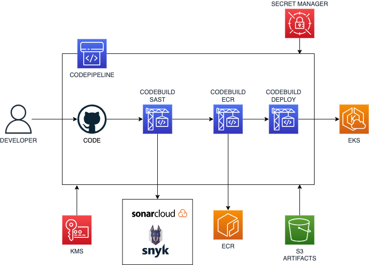

# DEVSU TEST APP

Implementación y despliegue de un servicio en java.

## Description

Se crean los recursos usando terraform y desplegando en AWS como cloud provider.





## Getting Started

En este desarrollo se utilizó Macos como sistema operativo para desplegar la infraestuctura usando un archivo Makefile

### Executing program

* How to run the program
```
make tf-init env=devsu-test
make tf-plan env=devsu-test
make tf-apply env=devsu-test
```
